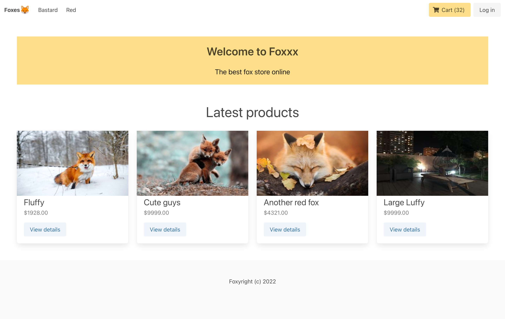
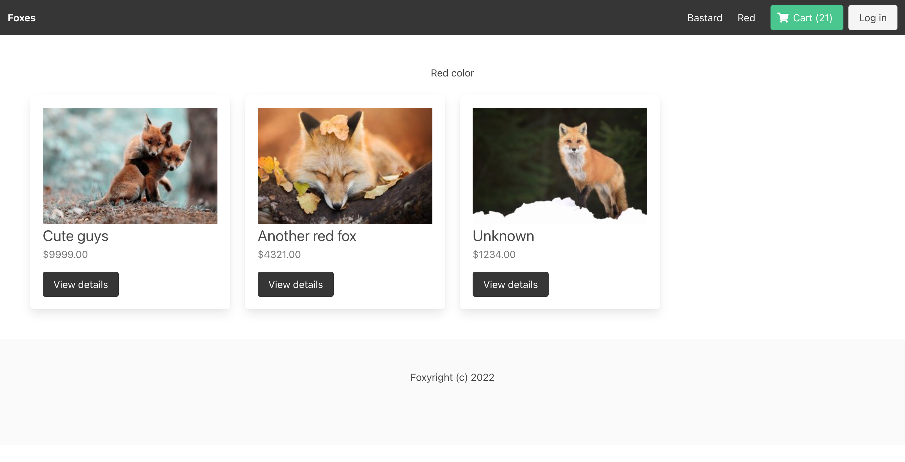
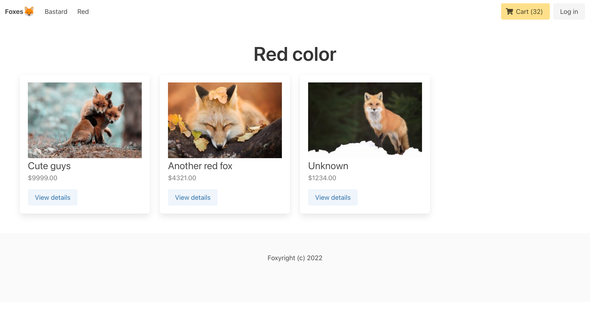

# Небольшой личный 🦊проект🦊, на примере которого я учусь.

Что, собственно, я использую в этом проекте:
<table>
<tr>
<th>Django</th>
<th>‎ ‎‎ ‎ ‎  ‎ ‎ ‎ ‎ ‎ ‎ ‎ ‎ ‎ ‎ Vue.js‎ ‎‎ ‎ ‎  ‎ ‎ ‎ ‎ ‎ ‎ ‎ ‎ ‎ ‎ </th>
</tr>
<tr>
<td>

|        Addons         |
| :-------------------: |
| `djangorestframework` |
| `django-cors-headers` |
|       `djoser`        |

</td><td>

| ‎ ‎‎ ‎ ‎ ‎ ‎ ‎ ‎ ‎ ‎ ‎ ‎ ‎ ‎ Addons‎ ‎‎ ‎ ‎ ‎ ‎ ‎ ‎ ‎ ‎ ‎ ‎ ‎ ‎ |
| :-------------------------------------------------------------: |
|                             `axios`                             |
|                             `bulma`                             |

</td></tr>
</table>

>#### Несколько скриншотов
>
>
>
